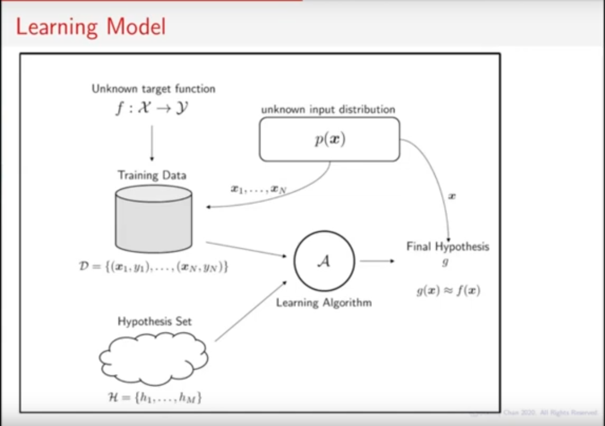

# Scratches

https://dengking.github.io/machine-learning/Theory/Deep-learning/Guide/Model-capacity/Model-capacity/

"The capacity of a deep learning neural network model controls the scope of the types of mapping functions that it is able to learn."

# Is Learning Feasible?
## What constitute a learning problem?
[ECE595ML Lecture 22-1 Is Learning Feasible?](https://www.youtube.com/watch?v=FZZGnPZT_ns&list=PL4FSfq6xtSvyqEsz3UUnAizemXJfQyDVD&index=49)

Quando treinamos um algoritmo (writing a paper) a diferenca entre o training e test set costuma ser na ordem de uma ou duas magnitudes (exemplos classicios do MNIST 60000/10000). Mas quando treinamos um algoritmo para funcionar no mundo real a diferenca entre o universo que ele foi treinado é muito maior: mesmo com um dataset de milhoes de imagens como IMAGENET, comparado a quantidade de imagens na internet, é infinitesimal.

IN-SAMPLE/OUT-SAMPLE (dentro/fora do dataset)

- Hypothesis set: $\mathcal{H} = \{ h_{1}, ..., h_{m} \}:$ Possible decision boundaries.
- Algorithm: Picks $h_{m}$ from $\mathcal{H}$.
- Final hypothesis: g (The one we find)

O conjunto $\mathcal{H}$ vai variar de acordo com os métodos e os modelos usados para atacar o problema.



## Is learning feasible?
Suppose we have a training set $\mathcal{D}$, can we learn the target function $f$?
- "Learn" means I came up with a f with the given data.
- "Successful" means all IN-SAMPLES are correctly predicted AND all OUT-SAMPLES are also correctly predicted.
- If YES, then learning is feasible.

In others words, can we generalize from the training set to the test set (or to the outworld unseen data)?

## Training vs Testing 
**In-Sample Error (Training Error)**
- $x_{n}$ is a training sample
- if $h(x_{n}) = f(x_{n})$, then we say that the training sample is correctly classified.

**DEFINITION (In-Sample Error / Training Error):**
Consider a training set $\mathcal{D} = \{ x_{1}, ..., x_{n} \}$, and a target function $f$. The **in-sample error** of a hypothesis function $h \in \mathcal{H}$ is the empirical average of $\{ h(x_{n}) \neq f(x_{n}) \}$:

$\begin{equation}  
E_{in}(h) {\stackrel{\text{def}}{=}} \frac {1}{N} \sum [\![ h(x_{n}) \neq f(x_{n})]\!]
\end{equation}$

where $[\![ \cdot ]\!] = 1 $ if the statement inside the brackets is true, and $= 0$ if the statement is false.

**Out-Sample Error (Testing Error)**
- $x$ is a test sample drawn from $p(x)$, where $p(x)$ is the unkwown input distribution.
- if $h(x) = f(x)$, then we say that the training sample is correctly classified.
- since $x \sim p(x)$, we need to compute the probability error, called the **out-sample error**. 

**DEFINITION (Out-Sample Error / Testing Error):**
Consider an input space $\mathcal{X}$ containing elements $x$ drawn from a distribution $p_{x}(x)$, and a target function $f$. The **out-sample error** of a hypothesis function $h \in \mathcal{H}$ is 

$\begin{equation}  
E_{out}(h) {\stackrel{\text{def}}{=}} \mathbb{P} [\ h(x) \neq f(x) ]\ 
\end{equation}$

where $\mathbb{P} [\ \cdot]\ $ measures the probability of the statement based on the distribution $p_{x}(x)$.

Because P is a Bernoulli distribution we can expand it as the expected value.

.

## The Role of $p(x)$
If there is no correlation between the training and the test set learning is infeasible

- Learning is feasible if $x \sim p(x)$.
- $p(x)$ says: Training and testing are related.
- If you draw training and testing with different bias, then you will suffer

Using probability inequalities (in this case, Hoeffding Inequality) we can relate trainig and testing.

### Interpreting the Bound
**Message 1:** You cand bound $E_{out}(h)$ using $E_{in}(h)$.
- $E_{in}(h)$: you know. $E_{out}(h)$: you don't know, but you want to know.
- They are close if N is large.

**Message 2:** The right hand side is independent of $h$ and $p(x)$.
- So it is a universal upper bound.
- Works for any $\mathcal{A}$, any $\mathcal{H}$, any $f$, and any $p(x)$.

---

## READING LIST
- High Dimensional Statistics ch. 2
- Learning from data ch. 1
- Foundations of ML ch. 2

## Relação entre Input Space e Feature Space

**Input Space** of a MNIST problem:
Image size: 28 * 28
Pixel depth: 256
Input $size = 256^(28*28)$ = Absurdamente grande

https://datascience.stackexchange.com/questions/60617/could-anyone-explain-these-terms-input-space-feature-space-sample-space

https://stats.stackexchange.com/questions/226369/what-is-an-input-space-and-why-does-the-fraction-of-the-input-space-covered-by

https://stats.stackexchange.com/questions/46425/what-is-feature-space

```
"Generalizing correctly becomes exponentially harder as the dimensionality (number of features) of the examples grows, because a fixed-size training set covers a dwindling fraction of the input space. Even with a moderate dimension of 100 and a huge training set of a trillion examples, the latter covers only a fraction of about 10−18 of the input space. This is what makes machine learning both necessary and hard."
```

**Hypothesis Space** also includes the output space. So for the MNIST case it would be:
10^256^(28*28)