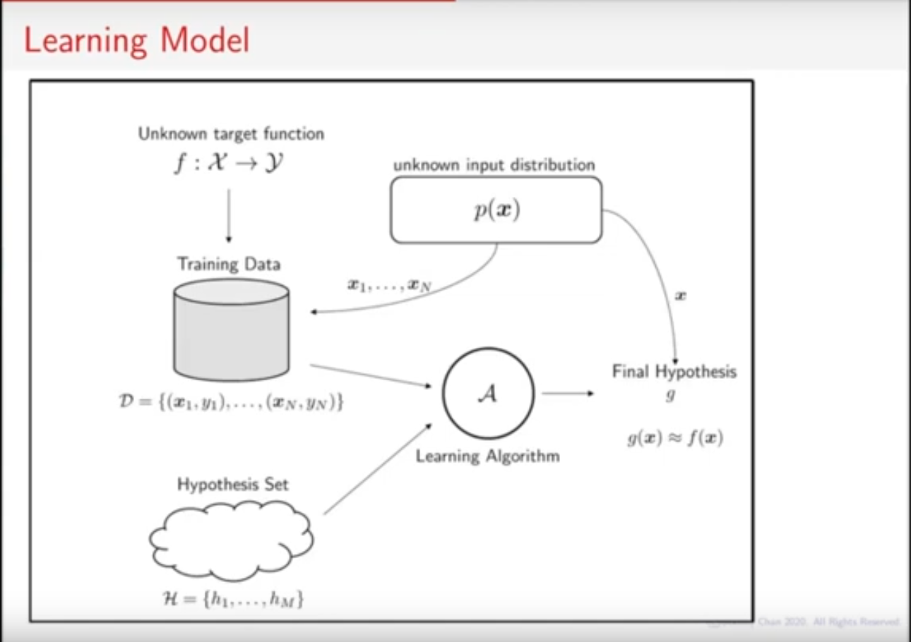

# Scratches

https://dengking.github.io/machine-learning/Theory/Deep-learning/Guide/Model-capacity/Model-capacity/

"The capacity of a deep learning neural network model controls the scope of the types of mapping functions that it is able to learn."


## What constitute a learning problem?
[ECE595ML Lecture 22-1 Is Learning Feasible?](https://www.youtube.com/watch?v=FZZGnPZT_ns&list=PL4FSfq6xtSvyqEsz3UUnAizemXJfQyDVD&index=49)

Quando treinamos um algoritmo (writing a paper) a diferenca entre o training e test set costuma ser na ordem de uma ou duas magnitudes (exemplos classicios do MNIST 60000/10000). Mas quando treinamos um algoritmo para funcionar no mundo real a diferenca entre o universo que ele foi treinado é muito maior: mesmo com um dataset de milhoes de imagens como IMAGENET, comparado a quantidade de imagens na internet, é infinitesimal.

IN-SAMPLE/OUT-SAMPLE (dentro/fora do dataset)

- Hypothesis set: H = {h1, ..., hm}: Possible decision boundaries
- Algorithms: Picks hm from H
- Final hypothesis: g (The one we find)

O conjunto H vai variar de acordo com os métodos e os modelos usados para atacar o problema.



## Is learning feasible?
Suppose we have a training set D, can we learn the target function f?
- "Learn" means I came up with a f with the given data.
- "Successful" means all IN-SAMPLES are correctly predicted AND all OUT-SAMPLES are also correctly predicted.
- If YES, then learning is feasible.

I others words, can we generalize from the training set to the test set (or to the outworld unseen data)?

## Training vs Testing 
**In-Sample (Training Error)**
- $xn$ is a training sample

**Out-Sample (Test Error)**
- xn is a test sample drawn from $p(x)$, where p(x) is the unkwo
 
---

## Relação entre Input Space e Feature Space

**Input Space** of a MNIST problem:
Image size: 28 * 28
Pixel depth: 256
Input size = 256^(28*28) = Absurdamente grande

https://datascience.stackexchange.com/questions/60617/could-anyone-explain-these-terms-input-space-feature-space-sample-space

https://stats.stackexchange.com/questions/226369/what-is-an-input-space-and-why-does-the-fraction-of-the-input-space-covered-by

https://stats.stackexchange.com/questions/46425/what-is-feature-space

```
"Generalizing correctly becomes exponentially harder as the dimensionality (number of features) of the examples grows, because a fixed-size training set covers a dwindling fraction of the input space. Even with a moderate dimension of 100 and a huge training set of a trillion examples, the latter covers only a fraction of about 10−18 of the input space. This is what makes machine learning both necessary and hard."
```

**Hypothesis Space** also includes the output space. So for the MNIST case it would be:
10^256^(28*28)